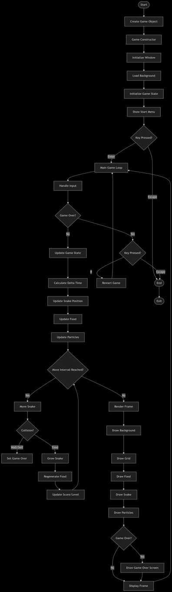
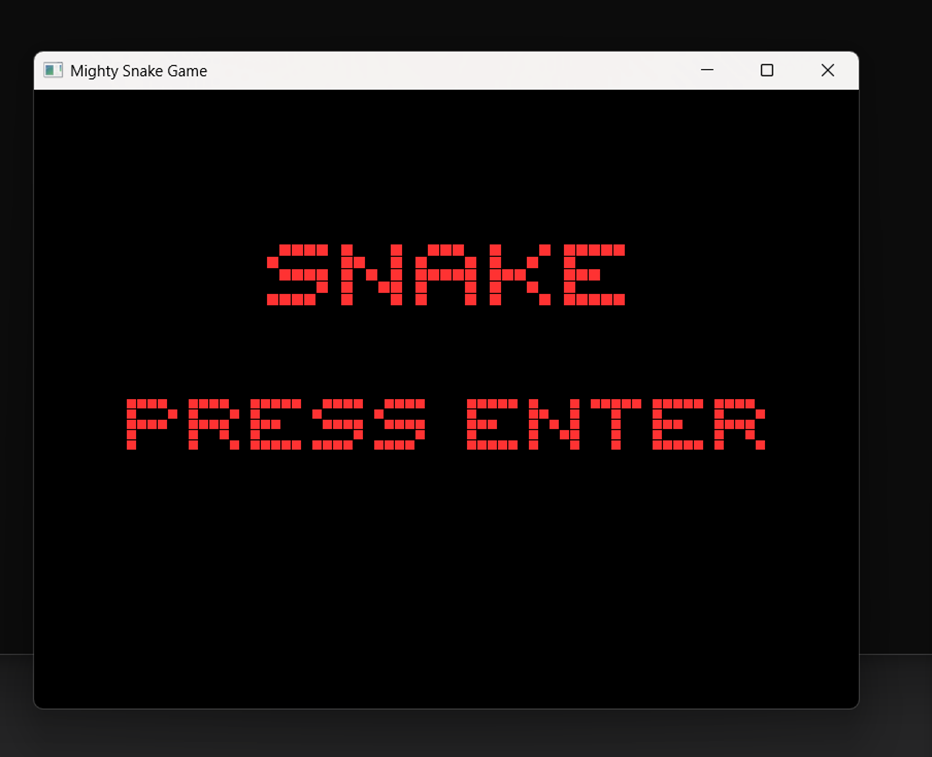
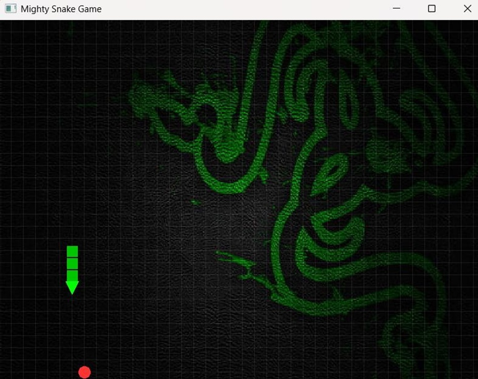

# Mighty-Snake Game
A robust implementation of the classic Snake game developed using **Object-Oriented Programming** principles in **C++** with the **SFML** library.

## 🚀 Key Features
* **Particle System:** Dynamic visual effects triggered upon eating food or game over scenarios.
* **OOP Architecture:** Clear and modular class structure for the Snake, Food, and Game states.
* **Smooth Rendering:** Integrated **LERP** (Linear Interpolation) for fluid movement and real-time score/level tracking.

## 📊 Technical Flow Diagram
The following diagram illustrates the initialization, main game loop, and collision logic of the project:

## 📸 Screenshots
### Game Start Screen
The retro-styled menu interface for initiating the gameplay loop.

### Gameplay Example
Showcasing the snake's movement, the food objective, and the dynamic background.

## 🛠 Tools & Libraries
* **Language:** C++
* **Graphics:** SFML (Simple and Fast Multimedia Library)
* **Development:** Visual Studio / MinGW

## 📝 How to Run
1.  Ensure you have the **SFML** library installed and configured in your environment.
2.  Compile the `Project 1.cpp` file.
3.  Place the `background.jpg` in the same directory as your executable.
4.  Run the application and press **ENTER** to start.
